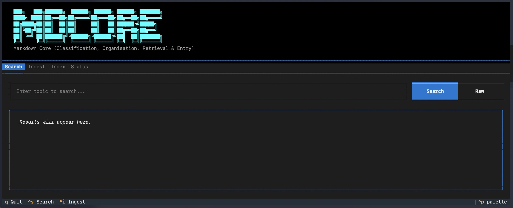
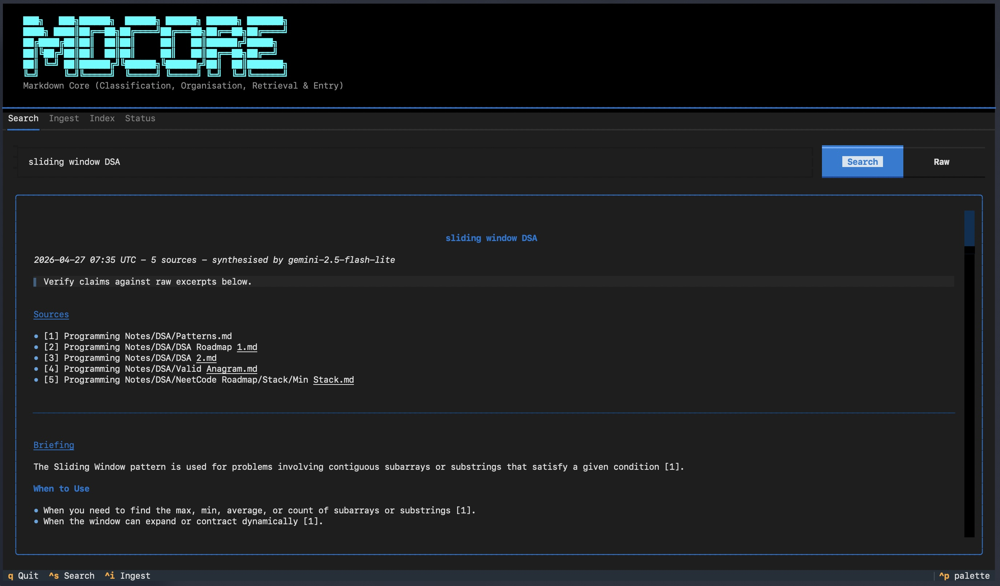
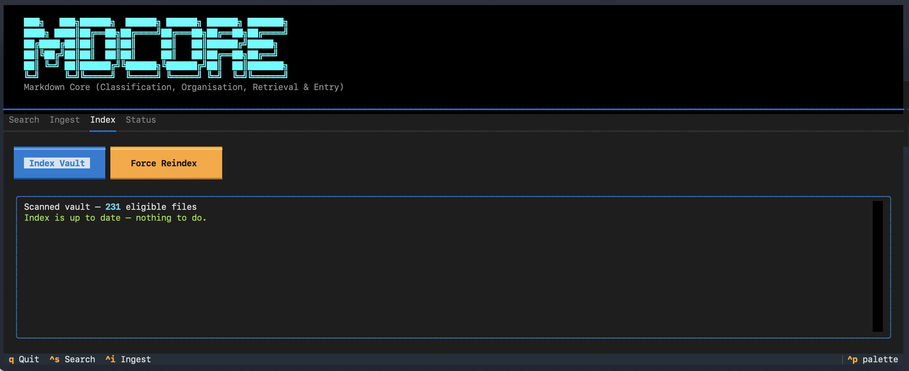
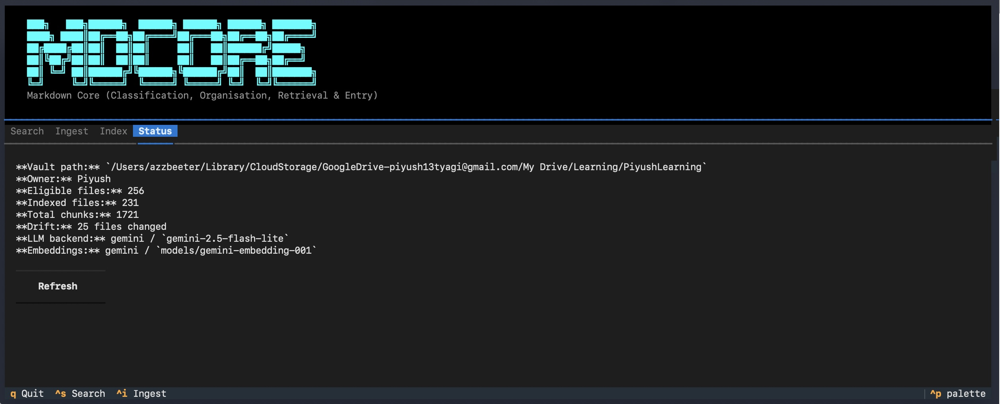

# mdcore

**Markdown CORE AI - Classification, Organisation, Retrieval & Entry**

`mdcore` is a local, LLM-agnostic knowledge base engine for anyone with a folder of markdown notes. It reads and writes your vault intelligently - retrieve context on demand, ingest new knowledge with automatic classification and routing, all from the terminal or a TUI.

**PyPI:** `markdowncore-ai` | **CLI:** `mdcore` | **Version:** 1.0.4

---

## Screenshots









---

## What It Does

**Retrieval (`mdcore search`)** - Ask a question or give a topic. mdcore searches your vault semantically, stitches the most relevant chunks, and synthesises a coherent cited briefing. Output lands in `<vault>/mdcore-output/` - ready to copy into any LLM conversation.

**Ingestion (`mdcore ingest`)** - Feed any document into mdcore - an LLM session summary, a research note, a strategy doc, an article. It classifies the content against your existing vault, routes it to the right folder, detects conflicts with existing notes, generates a proposal, and writes only after your explicit approval.

Both flows work fully local with Ollama. No subscription LLM API calls. No always-on server.

---

## Installation

```bash
# Recommended - with TUI
uv tool install "markdowncore-ai[gui]"

# With aggregator backend (free-tier key pool, no paid API needed)
uv tool install "markdowncore-ai[gui]" --with "llm-aggregator @ git+https://github.com/piyush-tyagi-13/llm-aggregator"

# pipx
pipx install markdowncore-ai
```

### Upgrading

```bash
# Upgrade mdcore only
uv tool upgrade markdowncore-ai

# Upgrade mdcore + llm-aggregator together
uv tool install --force --refresh "markdowncore-ai[gui]" --with "llm-aggregator @ git+https://github.com/piyush-tyagi-13/llm-aggregator"
```

### Ollama models (local inference)

```bash
ollama pull nomic-embed-text   # embeddings
ollama pull qwen3.5:4b         # classification, routing, proposals
ollama pull phi4-mini          # synthesis (fast, non-thinking)
```

### First run

```bash
mdcore init     # interactive setup -> writes ~/.mdcore/config.yaml
mdcore index    # scan and index your vault
```

---

## Quick Start

```bash
# Search your vault
mdcore search "kubernetes ingress routing"
# -> synthesised briefing written to <vault>/mdcore-output/
# -> copy contents, paste into Claude / ChatGPT / Gemini

# Ingest a document
mdcore ingest --file my-session-summary.md
# -> classifies, routes to right folder, proposes changes -> approve to write

# Launch TUI
mdcore gui
```

---

## Commands

```bash
mdcore init                        # Interactive setup wizard
mdcore index                       # Delta index - scan, diff, confirm, index
mdcore index --force               # Wipe everything and reindex from scratch
mdcore search <topic>              # Retrieve + synthesise briefing (Flow A)
mdcore search <topic> --raw        # Retrieve raw excerpts, skip synthesis
mdcore search <topic> --verbose    # Show similarity scores
mdcore ingest                      # Paste document - classify, route, propose (Flow B)
mdcore ingest --file <path>        # Ingest from file
mdcore map                         # Generate vault folder map for routing
mdcore map --repair                # Remove stale folder entries
mdcore gui                         # Launch TUI (requires [gui] extra)
mdcore status                      # Index health, drift warnings
mdcore eval [topic]                # Retrieval quality checklist
mdcore config                      # Open config in editor
mdcore config --validate           # Validate config
```

### Multiple vaults / config profiles

```bash
mdcore search "istio auth"     --config ~/.mdcore/config-work.yaml
mdcore search "career goals"   --config ~/.mdcore/config-personal.yaml
mdcore search "topic"          --models ~/.mdcore/models-aggregator.yaml
```

---

## Backends

mdcore supports local and API-backed models. Mix and match per use case.

| Backend | LLM | Embeddings | Extra needed |
|---|---|---|---|
| Ollama (local) | any pulled model | `nomic-embed-text`, `bge-m3` | none |
| Gemini | `gemini-2.5-flash-lite` | `models/gemini-embedding-001` | none (bundled) |
| OpenAI | `gpt-4o-mini` | `text-embedding-3-small` | `[openai]` |
| Anthropic | `claude-haiku-4-5` | use Ollama or OpenAI | `[anthropic]` |
| Aggregator | free-tier key pool | free-tier key pool | `[aggregator]` |

```bash
uv tool install "markdowncore-ai[openai]"
uv tool install "markdowncore-ai[anthropic]"
uv tool install "markdowncore-ai[all]"    # every backend
```

### Aggregator backend

`aggregator` routes calls through [llm-aggregator](https://github.com/piyush-tyagi-13/llm-aggregator) - a local SQLite-backed key pool that round-robins free-tier API keys with automatic 429 cooldown. No `api_key` needed in mdcore config.

Included in the recommended install command above. Keys DB lives at `~/.llm-aggregator/keys.db`.

Register free-tier keys (get them from the linked consoles - all have free tiers):

```bash
# Groq - https://console.groq.com/keys
llm-aggregator add groq <KEY> --model llama-3.3-70b-versatile --category general_purpose

# Cerebras - https://cloud.cerebras.ai
llm-aggregator add cerebras <KEY> --model llama-3.3-70b --category general_purpose

# Mistral - https://console.mistral.ai/api-keys
llm-aggregator add mistral <KEY> --model mistral-small-latest --category general_purpose

# OpenRouter - https://openrouter.ai/settings/keys
llm-aggregator add openrouter <KEY> --model meta-llama/llama-3.3-70b-instruct:free --category general_purpose

# Check registered keys
llm-aggregator status
```

```yaml
llm:
  backend: aggregator
  aggregator_category: general_purpose
  aggregator_rotate_every: 5

embeddings:
  backend: aggregator
  aggregator_category: general_purpose
```

### Hardware guidance

| Hardware | LLM | Embeddings |
|---|---|---|
| Apple M2 16GB+ | `qwen3.5:4b` | `nomic-embed-text` |
| i5 + RTX 4070 | `qwen3:8b` | `bge-m3` |
| Low-end / no GPU | `gemini-2.5-flash-lite` or `gpt-4o-mini` | `models/gemini-embedding-001` |

---

## Configuration

Config lives at `~/.mdcore/config.yaml`. Generated by `mdcore init`.

| Section | Key fields | Purpose |
|---|---|---|
| `vault` | `path`, `owner_name` | Vault root, owner name for multi-person vaults |
| `embeddings` | `backend`, `api_model` / `local_model`, `api_key` | Embedding model |
| `llm` | `backend`, `model`, `api_key`, `synthesise_model` | Primary LLM + synthesis model |
| `indexer` | `chunk_size`, `heading_aware_splitting` | Chunking strategy |
| `retriever` | `top_k`, `similarity_threshold` | Retrieval tuning |
| `ingester` | `similarity_threshold_high/low` | Classification thresholds |
| `writer` | `append_position`, `backup` | Write behaviour + backups |

See `config.yaml.example` for the full annotated reference.

### Separate models config

Keep model choices in a separate `~/.mdcore/models.yaml` - useful for switching backends without touching main config. Values here override `llm` and `embeddings` sections in `config.yaml`.

```yaml
# ~/.mdcore/models.yaml
llm:
  backend: aggregator
  aggregator_category: general_purpose

embeddings:
  backend: ollama
  local_model: nomic-embed-text
```

Pass explicitly with `--models`:

```bash
mdcore search "topic" --models ~/.mdcore/models-work.yaml
mdcore ingest --file note.md --models ~/.mdcore/models-cheap.yaml
```

---

## Where LLM Calls Happen

### `mdcore search` (Flow A)

| Phase | LLM? | Notes |
|---|---|---|
| Keyword pre-filter | No | BM25 scoring |
| Vector search | No | Embedding lookup |
| Chunk assembly | No | Pure text |
| **Synthesis** | **Yes** - `synthesise_model` | Skip with `--raw` for zero LLM calls |

### `mdcore ingest` (Flow B)

| Phase | LLM? | Condition |
|---|---|---|
| Embedding + search | No | Always |
| **Classification** | **Conditional** - `llm.model` | Only in ambiguous similarity range (0.65-0.82) |
| **Folder routing** | **Yes** - `llm.model` | NEW files only |
| **Proposal** | **Yes** - `llm.model` | Always before write |

`mdcore map` and `mdcore index` make no LLM calls.

---

## Observability

Token usage logged after every call to `~/.mdcore/logs/`:
```
INFO llm - tokens [gemini-2.5-flash-lite] in=312 out=89 total=401
```

LangSmith tracing (optional) - add to `~/.mdcore/config.yaml`:
```yaml
llm:
  langsmith_api_key: <your-key>
  langsmith_project: mdcore
```

---

*mdcore - Markdown CORE AI v1.0.4*
